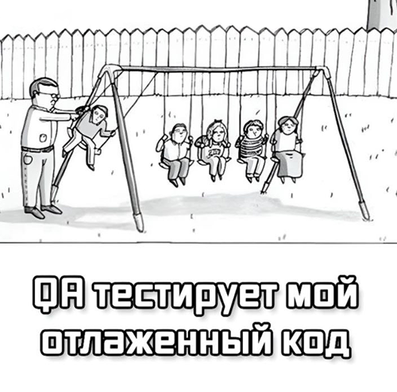

# Давайте знакомиться

Привет! Меня зовут Марика и я учусь на QA-инженера в Нетологии. 

Меня вдохновляют сложные и необъятные задачи, создание ценности для людей и выстраивание новых процессов. Ценю свое и чужое время, в команде для меня важны открытость и чувство юмора.

## Топ-3 факта обо мне
1. Считаю сохранение мемов для обмена в чате лучшим доказательством любви
2. Ненавижу геркулес, но обожаю овсянку (да, когда-то я думала, что это абсолютно разные каши)
3. Бываю невероятно душной

## О маленькой мечте

Раз уж мы научились печатать на 3D-принтере даже икеевские тефтели, то самое меньшее, что я хочу сделать, — напечатать крутой дом для своего кота.

## Для настроения

Как отреагировали друзья на начало моего обучения:

